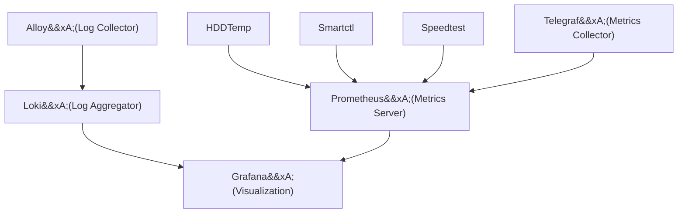

Grafana is an extremely powerful visualization tool that can be used to create dashboards and graphs from a variety of data sources to monitor your homelab.

When combined with Loki for log aggregation and Prometheus for metrics collection, you can create a comprehensive monitoring solution.
Both Loki and Prometheus use separate agents to collect data: Alloy for logs and Telegraf for metrics, as well as extra optional exporters for Prometheus to collect specific data points.

All of these applications create a network of observability, but can be confusing to wrap your head around.
This guide will help you understand how these applications work together, and how to get them set up as painlessly as possible.

## Applications

None of these are strictly required, but some are dependent on one another.
For example, None if the specific Prometheus exporters are required if you aren't interested in those metrics, but Prometheus itself is required to use them.

- [Grafana](../applications/grafana): Visualization tool for creating dashboards and graphs.
- [Loki](../applications/loki): Log aggregation system that collects and stores logs from various sources.
- [Alloy](../applications/alloy): Log collector that sends logs to Loki.
- [Prometheus](../applications/prometheus): Metrics server that collects and stores metrics data.
- [Telegraf](../applications/telegraf): Metrics collector that sends metrics to Prometheus.
- [Prometheus_hddtemp](../applications/prometheus_hddtemp): Exporter for collecting hard drive temperature metrics.
- [Prometheus_smartctl](../applications/prometheus_smartctl): Exporter for collecting SMART data from hard drives.
- [Prometheus_speedtest](../applications/prometheus_speedtest): Exporter for collecting internet speed test metrics.

## Application Visualization

With so many different applications working together, it can be hard to visualize how they all connect.



## Application Setup

To enable the entire monitoring stack, add the following to your `inventories/[your_inventory]/group_vars/homelab.yml` file:

```yaml title="inventories/homelab/group_vars/homelab.yml"
grafana_enabled: true

loki_enabled: true
alloy_enabled: true

prometheus_enabled: true
telegraf_enabled: true
prometheus_hddtemp_enabled: true
prometheus_smartctl_enabled: true
prometheus_speedtest_enabled: true
```

The next time you run the playbook, all of the applications will be installed.