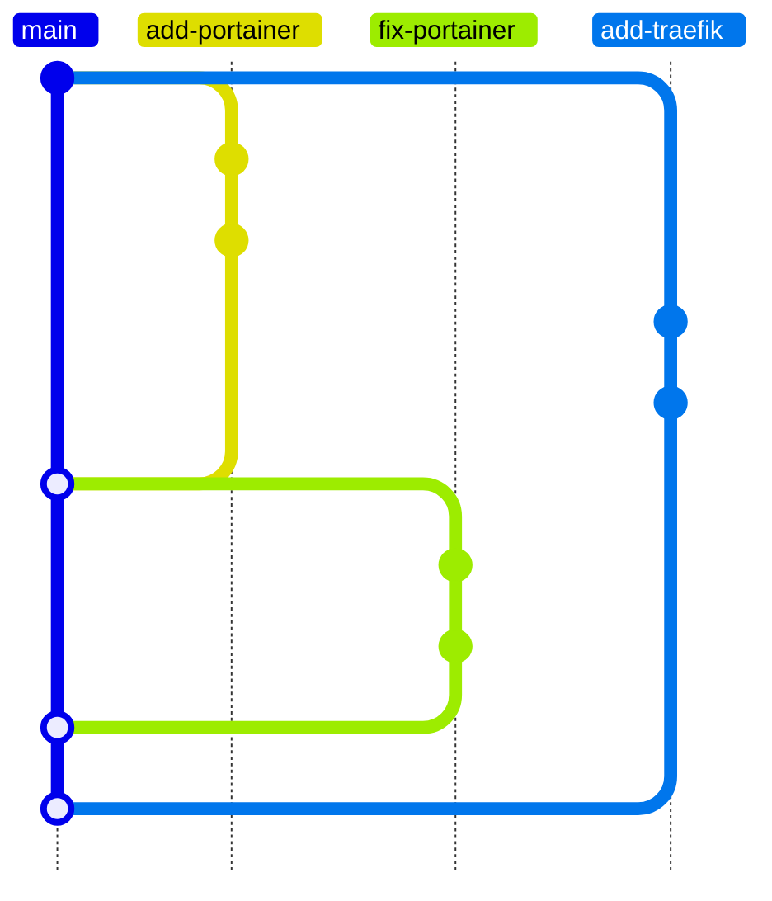

Contributing to Ansible Homelab Orchestration is welcome and encouraged!
There are many ways to contribute, from reporting issues to adding to documentation, to submitting code changes.

## Reporting Issues/Asking for Help

If you find a bug, have a feature request, or just have a question, please open an issue on the [GitHub repository](https://github.com/Dylancyclone/ansible-homelab-orchestration/issues/new/choose).

## Adding a New Application

See the [Adding Applications](../guides/adding-applications/) guide for instructions on how to add a new application.

## Submitting Changes

Before submitting your changes, please follow the following guidelines.

### Testing Changes

Ansible Homelab Orchestration also comes with a suite of automated tests to ensure clean code and functionality.
For example, the tests ensure:

- All created containers and networks are removed when stopping applications
- All applications have consistent variable names and settings
- All applications properly implement DNS and external access settings
- No port conflicts between applications
- etc

To run the tests, run:

```bash
python tests/test.py
```

Make sure all tests pass before submitting a pull request!

<details>
	<summary>Notes on tests</summary>
	In order to allow the tests to run without any dependencies, the tests are written
	from scratch instead of using a testing framework like `pytest`. I am aware this
	might not be the cleanest solution, but since 90% of the tests are parsing YAML
	files as opposed to testing functionality (since this is an Ansible playbook, and
	doesn't have much "code" to speak of), I felt this was the best approach. I am
	open to changing this though if a better solution comes up.
</details>

### Linting Changes

To ensure code quality and consistency, Ansible Homelab Orchestration uses [`ansible-lint`](https://github.com/ansible/ansible-lint).
To run the linter, run:

```bash
ansible-lint playbook.yml
```

Be sure to fix any linting errors before submitting a pull request!

### Commit Messages

This project uses [conventional commit messages](https://www.conventionalcommits.org/en/v1.0.0/).
This lets the playbook automatically detect breaking changes, and enables easily parsable changelogs.

The basic format of a commit message is:

```
<type>(<scope>)[!]: <short description>
```

Where:

- `<type>` is the type of change being made. This can be:
  - `feat` - A new feature or application
  - `fix` - A bug fix
  - `refactor` - Code changes that neither fix a bug nor add a feature
  - `chore` - Other changes that don't modify src or test files
  - `test` - Adding or updating tests
  - `build` - Changes that affect the build system
  - `ci` - Changes to CI configuration files and scripts
  - `docs` - Documentation changes
  - `perf` - Performance improvements
  - `revert` - Revert a previous commit
  - `style` - Code style changes (white-space, formatting, linting, etc)
- `<scope>` is the application or area being changed (e.g. `portainer`, `traefik`, etc)
- `!` is optional, and indicates a breaking change. You must include this if your change breaks backward compatibility.
- `<short description>` Where your normal commit message goes

#### Examples

```
feat(portainer): Add Portainer application
```

```
fix(portainer): Fix Portainer using the wrong port for external access
```

```
docs(portainer): Update links to Portainer's new home page
```

```
feat(portainer)!: Add newly required API key environment variable

Portainer now requires an API key to be set via an environment variable (`PORTAINER_API_KEY`), and will fail to start if it is not set.
```

Note that since this example describes a breaking change, the `!` is included after the scope, and a description of the breaking change is included in the commit body.
Also remember to update the documentation to reflect this change!

### Merging

This project uses the standard [GitHub Flow](https://docs.github.com/en/get-started/using-github/github-flow) for merging changes.
As much as I love linear history, this project relies on continuous history for breaking change detections.
This means **_DO NOT_** use squash merges or rebase merges or rebase in general if you can avoid it.

Breaking change detection works by reading all commit messages between the last time the user ran an application role and the current commit.
If the commits were rebased, there is no longer a continous line of commits to read, and thus breaking changes may be missed.

For Example:



### Submitting Your Changes

Once you have a bug fix, new application, or documentation update ready, you can submit your changes via a pull request on the [GitHub repository](https://github.com/Dylancyclone/ansible-homelab-orchestration).

Thank you for your contribution!
